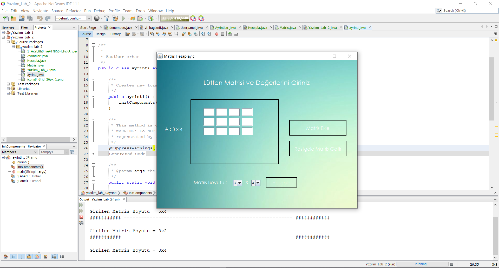
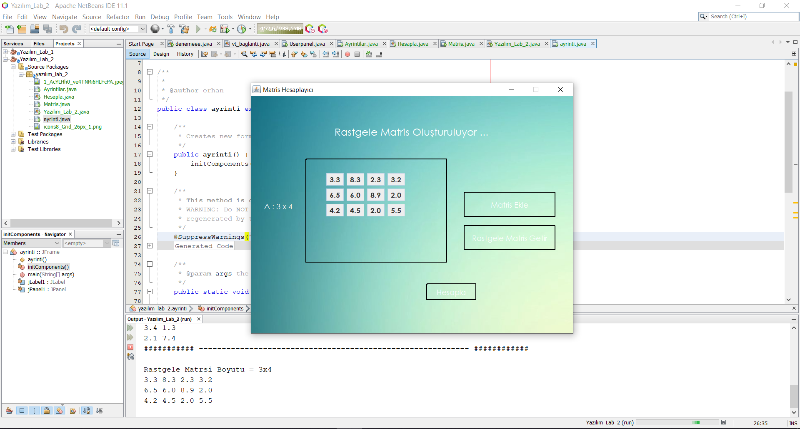
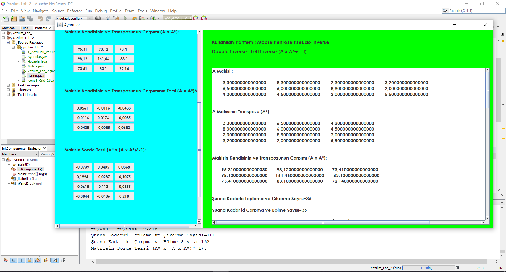

# Pseudo-Inverse-Calculator

### Java Moore Penrose Pseudo Inverse Calculator (Non-Square Matrix Inverse)

Non-Square matrices do not have an inverse but they have an pseudo inverse. In this project, we use Moore Penrose Pseudo Inverse for calculate matrix inverse. Users can choose random or manuel adding for creating matrices. After the calculation, all steps of the calculation are shown in detail.

### Creating Matrix (Manuel)

### Creating Matrix (Random)

### Calculation

### For more information see Rapor.docx

